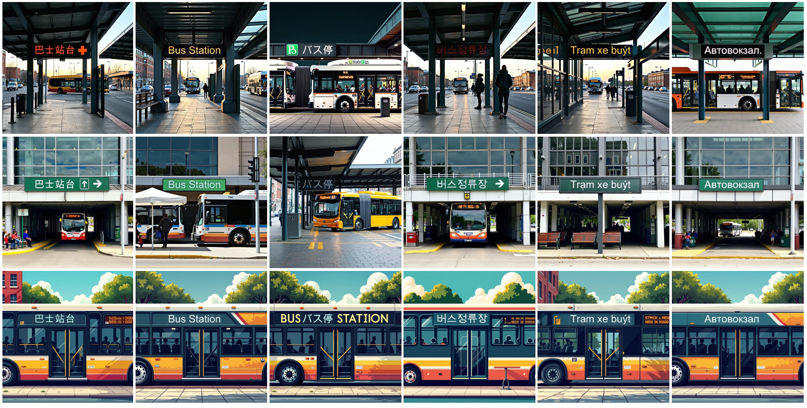

<div align="center">
<h1>RepText: Rendering Visual Text via Replicating </h1>

**Shakker Labs**, **Liblib AI**

<a href='[https://instantstyle.github.io/](https://reptext.github.io/)'></a>
<a href='[https://reptext.github.io/](https://reptext.github.io/)'></a>
[](https://huggingface.co/spaces/InstantX/InstantStyle)

</div>

We present RepText, which aims to empower pre-trained monolingual text-to-image generation models with the ability to accurately render, or more precisely, replicate, multilingual visual text in user-specified fonts, without the need to really understand them. Specifically, we adopt the setting from ControlNet and additionally integrate language agnostic glyph and position of rendered text to enable generating harmonized visual text, allowing users to customize text content, font and position on their needs. To improve accuracy, a text perceptual loss is employed along with the diffusion loss. Furthermore, to stabilize rendering process, at the inference phase, we directly initialize with noisy glyph latent instead of random initialization, and adopt region masks to restrict the feature injection to only the text region to avoid distortion of the background. We conducted extensive experiments to verify the effectiveness of our RepText relative to existing works, our approach outperforms existing open-source methods and achieves comparable results to native multi-language closed-source models.

<div align="center">

</div>

## Release

## Method

<div align="center">

</div>

<div align="center">

</div>

## Usage

## Compatibility to Other Works
- [FLUX.1-dev-ControlNet-Union-Pro-2.0](https://huggingface.co/Shakker-Labs/FLUX.1-dev-ControlNet-Union-Pro-2.0).
<div align="center">

</div>

- [FLUX.1-dev-Controlnet-Inpainting-Beta](https://huggingface.co/alimama-creative/FLUX.1-dev-Controlnet-Inpainting-Beta).
<div align="center">

</div>

- [FLUX.1-dev-IP-Adapter](https://huggingface.co/InstantX/FLUX.1-dev-IP-Adapter).
<div align="center">

</div>

## Generated Samples

<div align="center">



</div>

## Cite
If you find RepText useful for your research and applications, please cite us using this BibTeX:
```bibtex

```
For any question, feel free to contact us via haofanwang.ai@gmail.com.
